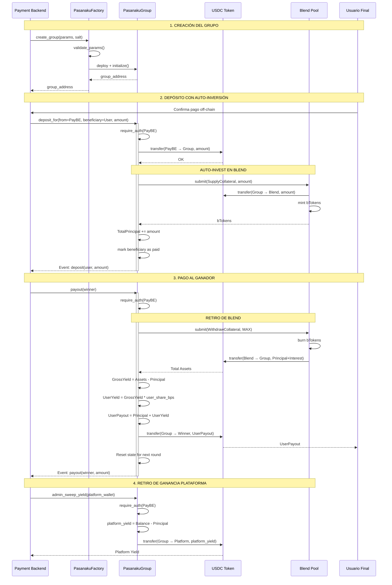

# PasaTanda - Smart Contracts para Soroban

Sistema de ahorro colaborativo (Tandas/Pasanakus) con generación automática de rendimiento a través del protocolo **Blend** en Stellar.

## 📋 Índice

1. [Arquitectura del Sistema](#arquitectura-del-sistema)
2. [Diagrama de Flujo](#diagrama-de-flujo)
3. [Contratos Implementados](#contratos-implementados)
4. [Integración con Blend](#integración-con-blend)
5. [Guía de Integración para Backend](#guía-de-integración-para-backend)
6. [Despliegue](#despliegue)
7. [Explicación Línea a Línea](#explicación-línea-a-línea)

---

## 🏗️ Arquitectura del Sistema

PasaTanda utiliza dos Smart Contracts principales:

### 1. **PasanakuFactory** (Factory Pattern)
- **Propósito**: Desplegar instancias estandarizadas de grupos de ahorro
- **Beneficios**: 
  - Código reutilizable y auditado
  - Configuración validada pre-despliegue
  - Registro centralizado de grupos
  - Cálculo determinístico de direcciones

### 2. **PasanakuGroup** (Lógica Central)
- **Propósito**: Gestionar el ciclo de vida de un grupo de ahorro
- **Características Clave**:
  - Auto-inversión en Blend Pool al recibir depósitos
  - Cálculo automático de rendimiento (yield)
  - Distribución configurable de ganancias (plataforma/usuarios)
  - Control de estado por ronda

---

## 📊 Diagrama de Flujo



---

## 🔧 Contratos Implementados

### PasanakuFactory

#### **Storage Schema**
```rust
StorageKey::GroupWasmHash     // BytesN<32>: Hash del WASM de PasanakuGroup
StorageKey::GroupsCreated     // Vec<GroupRecord>: Historial de grupos
StorageKey::TotalGroups       // u32: Contador
StorageKey::IsInitialized     // bool: Flag de inicialización
```

#### **Funciones Públicas**

##### `initialize(group_wasm_hash: BytesN<32>)`
- **Auth**: Ninguna (solo se llama una vez)
- **Acción**: Guarda el hash del WASM para despliegues futuros
- **Evento**: `factory_init(wasm_hash)`

##### `create_group(params: CreateGroupParams, salt: BytesN<32>) -> Address`
- **Auth**: Ninguna (cualquiera puede crear un grupo)
- **Validaciones**:
  - `members.len() >= 2`
  - `amount_per_round > 0`
  - `yield_share_bps <= 10000`
  - No direcciones duplicadas en `members`
- **Acción**: 
  1. Despliega nuevo contrato usando `deployer().with_current_contract(salt)`
  2. Inicializa el contrato con los parámetros
  3. Registra el grupo en el factory
- **Evento**: `group_created(address, admin, total_members)`
- **Return**: Address del nuevo grupo

##### Consultas Read-Only
- `get_total_groups() -> u32`
- `get_all_groups() -> Vec<GroupRecord>`
- `get_group_by_index(index: u32) -> GroupRecord`
- `get_wasm_hash() -> BytesN<32>`
- `compute_group_address(salt: BytesN<32>) -> Address`

---

### PasanakuGroup

#### **Storage Schema**
```rust
StorageKey::Admin             // Address: Payment Backend
StorageKey::GroupConfig       // GroupConfig: Configuración del grupo
StorageKey::YieldConfig       // YieldConfig: Configuración de rendimiento
StorageKey::TotalPrincipal    // i128: Capital neto (sin intereses)
StorageKey::Members           // Vec<MemberStatus>: Estado de pagos
StorageKey::CurrentRound      // u32: Ronda actual
StorageKey::IsInitialized     // bool
```

#### **Structs de Configuración**

```rust
pub struct GroupConfig {
    pub token: Address,          // Contract address de USDC
    pub amount_per_round: i128,  // Cuota en stroops (e.g., 100.0000000 = 100 USDC)
    pub frequency_days: u32,     // Días entre rondas
    pub total_members: u32,      // Número de participantes
}

pub struct YieldConfig {
    pub enabled: bool,           // Si genera rendimiento
    pub user_share_bps: u32,     // 7000 = 70% usuarios, 30% plataforma
    pub pool_address: Address,   // Blend Pool contract address
}

pub struct MemberStatus {
    pub address: Address,
    pub has_paid: bool,          // Reset cada ronda
}
```

#### **Funciones Públicas**

##### `initialize(admin, config, yield_config, members)`
- **Auth**: Ninguna (llamada por Factory)
- **Validaciones**:
  - No estar ya inicializado
  - `members.len() == config.total_members`
  - `yield_share_bps <= 10000`
- **Acción**: Guarda configuración y estado inicial
- **Evento**: `group_init(admin, total_members, yield_enabled)`

##### `deposit_for(from: Address, beneficiary: Address, amount: i128)`
- **Auth**: `from.require_auth()` (debe ser Admin/PayBE)
- **Validaciones**:
  - `amount == config.amount_per_round`
  - `beneficiary` debe ser miembro del grupo
- **Flujo**:
  1. **Transfer**: USDC de `from` → Contrato
  2. **Auto-Invest** (si yield_enabled):
     ```rust
     pool_client.submit(
         &contract_address,  // from
         &contract_address,  // spender
         &contract_address,  // to (recibe bTokens)
         &[Request {
             request_type: SupplyCollateral,
             address: token,
             amount: amount,
         }]
     )
     ```
  3. **Update State**:
     - `TotalPrincipal += amount`
     - `members[beneficiary].has_paid = true`
- **Evento**: `deposit(beneficiary, amount, total_principal)`

##### `payout(winner: Address)`
- **Auth**: Admin only
- **Validaciones**:
  - `TotalPrincipal > 0`
- **Flujo**:
  1. **Withdraw from Blend** (si yield_enabled):
     ```rust
     pool_client.submit(
         &contract_address,
         &contract_address,
         &contract_address,
         &[Request {
             request_type: WithdrawCollateral,
             address: token,
             amount: i128::MAX,  // Retirar todo
         }]
     )
     ```
  2. **Cálculo de Yield**:
     ```rust
     total_assets = token.balance(&contract)
     gross_yield = total_assets - total_principal
     user_yield = (gross_yield * user_share_bps) / 10000
     user_payout = total_principal + user_yield
     // El resto queda en el contrato para la plataforma
     ```
  3. **Transfer**: `user_payout` → `winner`
  4. **Reset**:
     - `TotalPrincipal = 0`
     - `members[*].has_paid = false`
     - `CurrentRound += 1`
- **Evento**: `payout(winner, amount, round)`

##### `admin_sweep_yield(to: Address)`
- **Auth**: Admin only
- **Acción**: 
  - Calcula excedente: `balance - total_principal`
  - Transfiere excedente a `to`
- **Evento**: `yield_sweep(to, amount)`

##### Consultas Read-Only
- `get_admin() -> Address`
- `get_config() -> GroupConfig`
- `get_yield_config() -> YieldConfig`
- `get_total_principal() -> i128`
- `get_current_round() -> u32`
- `get_members() -> Vec<MemberStatus>`
- `get_estimated_yield() -> i128`

---

## 🔗 Integración con Blend

### Interface del Pool Contract

Blend utiliza una función `submit()` unificada para todas las operaciones:

```rust
fn submit(
    env: Env,
    from: Address,      // Quien firma la transacción
    spender: Address,   // Quien gasta los tokens (para allowance)
    to: Address,        // Destinatario de tokens (en withdraw)
    requests: Vec<Request>,
)
```

### Request Types Utilizados

#### SupplyCollateral (Depósito)
```rust
Request {
    request_type: 0,  // SupplyCollateral
    address: token_address,
    amount: 1000_0000000,  // 1000 USDC en stroops
}
```
- **Acción**: Transfiere tokens al pool y recibe bTokens
- **Beneficio**: Los bTokens acumulan intereses automáticamente

#### WithdrawCollateral (Retiro)
```rust
Request {
    request_type: 1,  // WithdrawCollateral
    address: token_address,
    amount: i128::MAX,  // Retirar el máximo posible
}
```
- **Acción**: Quema bTokens y devuelve tokens + intereses acumulados
- **Nota**: Si `amount > bToken_balance`, se ajusta automáticamente

### Documentación Oficial
- **Pools en Mainnet**: Ver [Deployments](https://docs.blend.capital/mainnet-deployments)
- **Blend Pool Factory**: `CDSYOAVXFY7SM5S64IZPPPYB4GVGGLMQVFREPSQQEZVIWXX5R23G4QSU`
- **Documentación de integración**: https://docs.blend.capital/tech-docs/integrations/integrate-pool

---

## 🔌 Guía de Integración para Backend (PayBE)

### Arquitectura de Interacción

```
┌─────────────────────────────────────────────────────────────┐
│  Payment Backend (Node.js/Python)                           │
│  - Gestión de usuarios off-chain                            │
│  - Firma de transacciones con cuenta 'bmstellar'            │
│  - Escucha de eventos on-chain                              │
└─────────────────────────────────────────────────────────────┘
                            │
                            ▼
┌─────────────────────────────────────────────────────────────┐
│  Stellar SDK (stellar-sdk / soroban-client)                 │
│  - Construcción de invocaciones XDR                         │
│  - Simulación de transacciones                              │
│  - Envío a Horizon/Soroban RPC                              │
└─────────────────────────────────────────────────────────────┘
                            │
                            ▼
┌─────────────────────────────────────────────────────────────┐
│  Smart Contracts (Soroban)                                   │
│  - PasanakuFactory: Crear grupos                            │
│  - PasanakuGroup: Depósitos/Pagos                           │
└─────────────────────────────────────────────────────────────┘
```

### Funciones a Invocar

#### 1. Crear un Nuevo Grupo

**Función**: `PasanakuFactory::create_group`

**Argumentos XDR**:
```typescript
// Usando stellar-sdk (TypeScript)
import { Contract, Address, nativeToScVal } from '@stellar/stellar-sdk';

const params = {
    admin: new Address(PAYMENT_BACKEND_ADDRESS).toScVal(),
    token: new Address(USDC_CONTRACT_ADDRESS).toScVal(),
    amount_per_round: nativeToScVal(100_0000000, { type: 'i128' }), // 100 USDC
    frequency_days: nativeToScVal(7, { type: 'u32' }),
    members: nativeToScVal(
        [memberAddr1, memberAddr2, memberAddr3],
        { type: ['Address'] }
    ),
    yield_enabled: nativeToScVal(true, { type: 'bool' }),
    yield_share_bps: nativeToScVal(7000, { type: 'u32' }), // 70%
    blend_pool_address: new Address(BLEND_POOL_ADDRESS).toScVal(),
};

const salt = crypto.randomBytes(32); // Salt único

const contract = new Contract(FACTORY_ADDRESS);
const operation = contract.call(
    'create_group',
    nativeToScVal(params, { type: 'CreateGroupParams' }),
    salt
);
```

**Return**: `Address` del nuevo grupo creado

**Eventos a Escuchar**:
- `group_created`: Confirma creación exitosa
  ```typescript
  {
      topics: ['group_created'],
      data: {
          group_address: Address,
          admin: Address,
          total_members: u32,
      }
  }
  ```

---

#### 2. Registrar un Depósito

**Función**: `PasanakuGroup::deposit_for`

**Argumentos XDR**:
```typescript
const contract = new Contract(GROUP_ADDRESS);
const operation = contract.call(
    'deposit_for',
    new Address(PAYMENT_BACKEND_ADDRESS).toScVal(),  // from (requiere auth)
    new Address(BENEFICIARY_USER_ADDRESS).toScVal(),  // beneficiary
    nativeToScVal(100_0000000, { type: 'i128' })     // amount
);
```

**Autorización Requerida**:
- Debe incluir `InvokeHostFunctionOp` con auth de `PAYMENT_BACKEND_ADDRESS`
- Incluir también autorización para `transfer` del token USDC

**Eventos a Escuchar**:
- `deposit`: Confirma depósito registrado
  ```typescript
  {
      topics: ['deposit'],
      data: {
          beneficiary: Address,
          amount: i128,
          total_principal: i128,
      }
  }
  ```

**Validaciones Pre-Invocación** (Opcional):
```typescript
// Verificar que el beneficiary es miembro
const members = await groupContract.get_members();
const isMember = members.some(m => m.address === beneficiary);

// Verificar que no ha pagado ya esta ronda
const memberStatus = members.find(m => m.address === beneficiary);
if (memberStatus.has_paid) {
    throw new Error('Member already paid this round');
}
```

---

#### 3. Ejecutar Pago al Ganador

**Función**: `PasanakuGroup::payout`

**Argumentos XDR**:
```typescript
const contract = new Contract(GROUP_ADDRESS);
const operation = contract.call(
    'payout',
    new Address(WINNER_ADDRESS).toScVal()
);
```

**Autorización Requerida**:
- Solo Admin puede ejecutar esta función

**Eventos a Escuchar**:
- `payout`: Confirma pago exitoso
  ```typescript
  {
      topics: ['payout'],
      data: {
          winner: Address,
          amount: i128,
          round: u32,
      }
  }
  ```

**Post-Procesamiento Recomendado**:
1. Actualizar DB off-chain con el ganador y monto
2. Notificar al ganador vía email/push
3. Llamar a `admin_sweep_yield` para retirar ganancia de plataforma

---

#### 4. Retirar Ganancia de Plataforma

**Función**: `PasanakuGroup::admin_sweep_yield`

**Argumentos XDR**:
```typescript
const contract = new Contract(GROUP_ADDRESS);
const operation = contract.call(
    'admin_sweep_yield',
    new Address(PLATFORM_TREASURY_ADDRESS).toScVal()
);
```

**Timing Recomendado**:
- Ejecutar después de cada `payout`
- O acumular y retirar periódicamente (semanal/mensual)

**Eventos a Escuchar**:
- `yield_sweep`:
  ```typescript
  {
      topics: ['yield_sweep'],
      data: {
          to: Address,
          amount: i128,
      }
  }
  ```

---

### Consultas Read-Only (No requieren firma)

#### Obtener Estado del Grupo
```typescript
const config = await groupContract.get_config();
const yieldConfig = await groupContract.get_yield_config();
const totalPrincipal = await groupContract.get_total_principal();
const currentRound = await groupContract.get_current_round();
const members = await groupContract.get_members();
const estimatedYield = await groupContract.get_estimated_yield();
```

#### Calcular Payout Proyectado
```typescript
// Para mostrar en UI antes del pago
const totalPrincipal = await groupContract.get_total_principal();
const estimatedYield = await groupContract.get_estimated_yield();
const yieldConfig = await groupContract.get_yield_config();

const userYield = (estimatedYield * yieldConfig.user_share_bps) / 10000;
const projectedPayout = totalPrincipal + userYield;

console.log(`Pago estimado: ${projectedPayout / 10000000} USDC`);
```

---

### Monitoreo de Eventos (Event Streaming)

Implementar un listener continuo para sincronizar estado:

```typescript
// Pseudo-código usando Soroban RPC
const eventStream = sorobanRPC.getEvents({
    contractIds: [GROUP_ADDRESS],
    topics: [['deposit'], ['payout'], ['yield_sweep']],
    startLedger: lastProcessedLedger,
});

eventStream.on('data', async (event) => {
    switch(event.topic[0]) {
        case 'deposit':
            await updateUserPaymentStatus(event.data.beneficiary);
            break;
        case 'payout':
            await recordPayoutInDB(event.data.winner, event.data.amount);
            await notifyWinner(event.data.winner);
            break;
        case 'yield_sweep':
            await recordPlatformRevenue(event.data.amount);
            break;
    }
});
```

---

### Consideraciones de Seguridad

1. **Autorización de Depósitos**:
   - El contrato solo permite que el `Admin` (PayBE) llame a `deposit_for`
   - Esto evita que usuarios depositen directamente (bypass del sistema de pagos)

2. **Protección contra Re-entrancy**:
   - El contrato actualiza estado ANTES de transferir tokens
   - Pattern: Check-Effects-Interactions

3. **Validación de Montos**:
   - El contrato valida que `amount == config.amount_per_round`
   - No confiar en validación solo del backend

4. **Gestión de Keys**:
   - Usar Hardware Security Module (HSM) para la key `bmstellar`
   - Implementar rate limiting en el backend
   - Configurar multisig para operaciones críticas (opcional)

---

### Flujo Completo de una Ronda

```typescript
// 1. Usuario paga off-chain (Stripe, transferencia bancaria, etc.)
await processOffchainPayment(userId, amount);

// 2. Backend registra el depósito on-chain
const depositTx = await groupContract.deposit_for(
    PAYMENT_BACKEND_ADDRESS,
    userWalletAddress,
    amount
);
await depositTx.simulate();
await depositTx.sign(bmstellarKeypair);
await depositTx.submit();

// 3. Esperar confirmación
const depositResult = await depositTx.getResult();
console.log('Deposit confirmed:', depositResult.events);

// 4. Al finalizar ronda, seleccionar ganador (lógica off-chain)
const winner = await selectWinner(groupId);

// 5. Ejecutar payout
const payoutTx = await groupContract.payout(winner.address);
await payoutTx.sign(bmstellarKeypair);
await payoutTx.submit();

// 6. Retirar ganancia de plataforma
const sweepTx = await groupContract.admin_sweep_yield(TREASURY_ADDRESS);
await sweepTx.sign(bmstellarKeypair);
await sweepTx.submit();

// 7. Actualizar estado off-chain
await updateRoundStatus(groupId, currentRound + 1);
await notifyAllMembers(groupId, `Ronda ${currentRound} completada`);
```

---

### Ejemplo de Configuración Testnet

```typescript
// Configuración de red
const NETWORK = 'testnet';
const RPC_URL = 'https://soroban-testnet.stellar.org';
const HORIZON_URL = 'https://horizon-testnet.stellar.org';

// Contratos desplegados (reemplazar con addresses reales)
const FACTORY_ADDRESS = 'C...';  // Dirección del Factory
const USDC_ADDRESS = 'C...';     // USDC en Testnet
const BLEND_POOL_ADDRESS = 'C...'; // Pool de Blend en Testnet

// Cuenta de administración
const PAYMENT_BACKEND_KEYPAIR = StellarSdk.Keypair.fromSecret(
    process.env.BMSTELLAR_SECRET_KEY
);
```

---

## 📦 Despliegue

### Requisitos Previos
- Rust 1.74+
- Soroban CLI 21.0+
- Cuenta 'bmstellar' con fondos en Testnet

### Pasos de Despliegue

#### 1. Build de Contratos
```bash
cd contracts/pasanaku-group
make build

cd ../pasanaku-factory
make build
```

#### 2. Instalar WASM de PasanakuGroup
```bash
cd contracts/pasanaku-group
WASM_HASH=$(make install-wasm-testnet)
echo "Group WASM Hash: $WASM_HASH"
```

#### 3. Desplegar Factory
```bash
cd ../pasanaku-factory
FACTORY_ADDRESS=$(make deploy-testnet)
echo "Factory Address: $FACTORY_ADDRESS"
```

#### 4. Inicializar Factory
```bash
soroban contract invoke \
  --id $FACTORY_ADDRESS \
  --source bmstellar \
  --network testnet \
  -- \
  initialize \
  --group_wasm_hash $WASM_HASH
```

#### 5. Crear Primer Grupo (Ejemplo)
```bash
soroban contract invoke \
  --id $FACTORY_ADDRESS \
  --source bmstellar \
  --network testnet \
  -- \
  create_group \
  --params '{
    "admin": "GBMSTELLAR...",
    "token": "CUSDC...",
    "amount_per_round": "1000000000",
    "frequency_days": 7,
    "members": ["GA...", "GB...", "GC..."],
    "yield_enabled": true,
    "yield_share_bps": 7000,
    "blend_pool_address": "CBLEND..."
  }' \
  --salt $(openssl rand -hex 32)
```

---

## 📖 Explicación Línea a Línea

### PasanakuGroup - Función `deposit_for`

```rust
pub fn deposit_for(
    env: Env,
    from: Address,
    beneficiary: Address,
    amount: i128,
) {
```
**Línea 1-5**: Definición de la función pública que permite al Payment Backend depositar fondos a nombre de un miembro.
- `env`: Entorno de ejecución de Soroban (acceso a storage, eventos, blockchain)
- `from`: Quien envía los fondos (debe ser el Admin/PayBE)
- `beneficiary`: Usuario que está pagando su cuota
- `amount`: Monto en stroops (1 USDC = 10000000 stroops)

```rust
    let admin: Address = env.storage().instance().get(&StorageKey::Admin).unwrap();
    admin.require_auth();
```
**Línea 7-8**: **SEGURIDAD CRÍTICA**
- Recupera la dirección del Admin configurada en la inicialización
- `require_auth()` verifica la firma criptográfica en la transacción
- Si la firma no coincide con `admin`, la transacción falla con panic

```rust
    let config: GroupConfig = env.storage().instance().get(&StorageKey::GroupConfig).unwrap();
    if amount != config.amount_per_round {
        panic!("Amount must match configured amount_per_round");
    }
```
**Línea 10-13**: **VALIDACIÓN DE MONTO**
- Previene depósitos parciales o incorrectos
- Asegura consistencia: todos pagan exactamente lo mismo

```rust
    let yield_config: YieldConfig = env.storage().instance().get(&StorageKey::YieldConfig).unwrap();
```
**Línea 15**: Obtiene la configuración de yield management (si Blend está habilitado)

```rust
    let token_client = token::Client::new(&env, &config.token);
    token_client.transfer(&from, &env.current_contract_address(), &amount);
```
**Línea 17-18**: **TRANSFERENCIA DE FONDOS**
- Crea un cliente para el token USDC (implementa SEP-41)
- Transfiere `amount` de la cuenta del Admin → Contrato
- Esta operación requiere que `from` haya aprobado el contrato o firmado la tx

```rust
    if yield_config.enabled {
```
**Línea 20**: Verifica si la generación de rendimiento está habilitada

```rust
        let mut requests = Vec::new(&env);
        requests.push_back(Request {
            request_type: RequestType::SupplyCollateral as u32,
            address: config.token.clone(),
            amount,
        });
```
**Línea 22-26**: **PREPARACIÓN DE REQUEST PARA BLEND**
- Crea un vector de requests (Blend permite batch operations)
- `SupplyCollateral` (tipo 0): Presta tokens al pool y permite usar como colateral
- Esto permite que el pool invierta los fondos y genere rendimiento

```rust
        let pool_client = blend_pool::Client::new(&env, &yield_config.pool_address);
        pool_client.submit(
            &env.current_contract_address(),  // from: quien firma (este contrato)
            &env.current_contract_address(),  // spender: quien gasta los tokens
            &env.current_contract_address(),  // to: quien recibe bTokens
            &requests,
        );
```
**Línea 28-34**: **LLAMADA CROSS-CONTRACT A BLEND**
- Crea un cliente para interactuar con el Pool Contract de Blend
- `submit()` es la función unificada de Blend para todas las operaciones
- Después de esta llamada:
  1. El USDC se transfiere del Contrato → Blend Pool
  2. El Contrato recibe bTokens (tokens que representan la posición + intereses)
  3. Los bTokens automáticamente acumulan valor con el tiempo

```rust
    let mut total_principal: i128 = env.storage().instance().get(&StorageKey::TotalPrincipal).unwrap();
    total_principal += amount;
    env.storage().instance().set(&StorageKey::TotalPrincipal, &total_principal);
```
**Línea 37-39**: **ACTUALIZACIÓN DEL PRINCIPAL**
- `TotalPrincipal`: Rastrea solo el capital depositado (sin intereses)
- Esto es crítico para calcular el yield neto en `payout()`
- Ejemplo: Si depositan 3 usuarios × 100 USDC = TotalPrincipal = 300 USDC

```rust
    let mut members: Vec<MemberStatus> = env.storage().instance().get(&StorageKey::Members).unwrap();
    let mut found = false;
    for i in 0..members.len() {
        let mut member = members.get(i).unwrap();
        if member.address == beneficiary {
            member.has_paid = true;
            members.set(i, member);
            found = true;
            break;
        }
    }
    if !found {
        panic!("Beneficiary not a member");
    }
    env.storage().instance().set(&StorageKey::Members, &members);
```
**Línea 41-55**: **ACTUALIZACIÓN DE ESTADO DEL MIEMBRO**
- Busca al beneficiary en la lista de miembros
- Marca `has_paid = true` para esta ronda
- Si el beneficiary no es miembro, la transacción falla
- Previene que alguien deposite a nombre de una persona no autorizada

```rust
    env.events().publish(
        (Symbol::new(&env, "deposit"),),
        (beneficiary, amount, total_principal),
    );
```
**Línea 57-60**: **EMISIÓN DE EVENTO**
- Publica un evento on-chain que el backend puede escuchar
- Permite sincronización off-chain sin necesidad de polling continuo
- El evento contiene: quién pagó, cuánto, y el nuevo total acumulado

---

### PasanakuGroup - Función `payout`

```rust
pub fn payout(env: Env, winner: Address) {
```
**Línea 1**: Función que ejecuta el pago al ganador de la ronda

```rust
    let admin: Address = env.storage().instance().get(&StorageKey::Admin).unwrap();
    admin.require_auth();
```
**Línea 3-4**: **SEGURIDAD**: Solo el Admin puede ejecutar payouts

```rust
    let config: GroupConfig = env.storage().instance().get(&StorageKey::GroupConfig).unwrap();
    let yield_config: YieldConfig = env.storage().instance().get(&StorageKey::YieldConfig).unwrap();
    let total_principal: i128 = env.storage().instance().get(&StorageKey::TotalPrincipal).unwrap();
```
**Línea 6-8**: Carga todas las configuraciones necesarias

```rust
    if total_principal <= 0 {
        panic!("No funds to payout");
    }
```
**Línea 10-12**: Validación: No se puede pagar si no hay fondos depositados

```rust
    let user_payout: i128;

    if yield_config.enabled {
```
**Línea 14-16**: Declara la variable que contendrá el monto final a pagar

```rust
        let mut requests = Vec::new(&env);
        requests.push_back(Request {
            request_type: RequestType::WithdrawCollateral as u32,
            address: config.token.clone(),
            amount: i128::MAX,  // Retirar el máximo posible
        });
```
**Línea 18-23**: **PREPARACIÓN DE RETIRO DE BLEND**
- `WithdrawCollateral` (tipo 1): Retira fondos + intereses
- `i128::MAX`: Indica "retirar toda mi posición"
- Blend ajusta automáticamente si se solicita más de lo disponible

```rust
        let pool_client = blend_pool::Client::new(&env, &yield_config.pool_address);
        pool_client.submit(
            &env.current_contract_address(),
            &env.current_contract_address(),
            &env.current_contract_address(),  // to: los fondos vuelven al contrato
            &requests,
        );
```
**Línea 25-31**: **RETIRO DE BLEND**
- Después de esta llamada:
  1. Los bTokens se queman (burn)
  2. El USDC (Principal + Intereses) se transfiere Blend → Contrato
  3. El balance del contrato ahora incluye el rendimiento

```rust
        let token_client = token::Client::new(&env, &config.token);
        let total_assets = token_client.balance(&env.current_contract_address());
        let gross_yield = total_assets - total_principal;
```
**Línea 33-35**: **CÁLCULO DE RENDIMIENTO BRUTO**
- `total_assets`: Balance actual del contrato (después del withdraw)
- `gross_yield`: Intereses generados en Blend
- Ejemplo: Si `total_principal = 300 USDC` y `total_assets = 315 USDC`, entonces `gross_yield = 15 USDC`

```rust
        if gross_yield > 0 {
            let user_yield = (gross_yield * yield_config.user_share_bps as i128) / 10000;
            user_payout = total_principal + user_yield;
        } else {
            user_payout = total_principal;
        }
```
**Línea 37-42**: **DISTRIBUCIÓN DE YIELD**
- Si `user_share_bps = 7000` (70%):
  - `user_yield = 15 USDC × 7000 / 10000 = 10.5 USDC`
  - `user_payout = 300 + 10.5 = 310.5 USDC`
  - Quedan en el contrato: `315 - 310.5 = 4.5 USDC` (ganancia plataforma)
- Si no hubo yield, solo devolver el principal

```rust
    } else {
        user_payout = total_principal;
    }
```
**Línea 43-45**: Si yield está deshabilitado, solo pagar el principal

```rust
    let token_client = token::Client::new(&env, &config.token);
    token_client.transfer(
        &env.current_contract_address(),
        &winner,
        &user_payout,
    );
```
**Línea 47-52**: **TRANSFERENCIA AL GANADOR**
- Envía el payout calculado del Contrato → Wallet del ganador

```rust
    env.storage().instance().set(&StorageKey::TotalPrincipal, &0i128);
```
**Línea 54**: **RESET DEL PRINCIPAL**
- Prepara el contrato para la siguiente ronda
- El yield de la plataforma queda en el contrato hasta que se llame a `admin_sweep_yield`

```rust
    let mut members: Vec<MemberStatus> = env.storage().instance().get(&StorageKey::Members).unwrap();
    for i in 0..members.len() {
        let mut member = members.get(i).unwrap();
        member.has_paid = false;
        members.set(i, member);
    }
    env.storage().instance().set(&StorageKey::Members, &members);
```
**Línea 56-62**: **RESET DE ESTADO DE PAGOS**
- Todos los miembros vuelven a `has_paid = false`
- Permite que depositen nuevamente en la siguiente ronda

```rust
    let current_round: u32 = env.storage().instance().get(&StorageKey::CurrentRound).unwrap();
    env.storage().instance().set(&StorageKey::CurrentRound, &(current_round + 1));
```
**Línea 64-65**: **INCREMENTAR RONDA**
- Rastrea el progreso del grupo

```rust
    env.events().publish(
        (Symbol::new(&env, "payout"),),
        (winner, user_payout, current_round),
    );
}
```
**Línea 67-70**: **EVENTO DE PAYOUT**
- Notifica al backend que el pago fue exitoso
- Incluye: ganador, monto pagado, y número de ronda

---

## 🔒 Consideraciones de Seguridad Adicionales

### 1. Ataques de Re-entrancy
- **Mitigación**: Actualizamos estado ANTES de hacer transferencias externas
- Pattern: Check → Effects → Interactions

### 2. Overflow/Underflow
- **Mitigación**: Rust previene automáticamente en modo debug
- Compilación con `overflow-checks = true` en release

### 3. Autorización Granular
- Solo Admin puede:
  - `deposit_for()`
  - `payout()`
  - `admin_sweep_yield()`
- Usuarios NO pueden interactuar directamente con el contrato

### 4. Validación de Montos
- No confiar en validación del backend
- El contrato valida `amount == amount_per_round`

### 5. Protección contra Yield Manipulation
- `TotalPrincipal` se rastrea independientemente del balance
- Previene que alguien envíe tokens directamente al contrato para inflar el yield

---

## 📊 Métricas y Monitoreo Recomendado

### KPIs On-Chain
1. **Total Value Locked (TVL)**: Suma de `TotalPrincipal` de todos los grupos
2. **Yield Generado**: Promedio de `get_estimated_yield()` por grupo
3. **Tasa de Completitud**: % de rondas finalizadas exitosamente
4. **Ganancia Plataforma**: Suma de eventos `yield_sweep`

### Alertas Críticas
- Si `get_estimated_yield() < 0`: Indica pérdida en Blend (improbable pero posible)
- Si `payout` falla repetidamente: Revisar liquidez del Blend Pool
- Si `TotalPrincipal` no coincide con depósitos registrados: Posible error de sincronización

---

## 🚀 Próximos Pasos

1. **Testing Exhaustivo**:
   - Tests de integración con Blend en Testnet
   - Simular múltiples rondas completas
   - Stress testing con 50+ miembros

2. **Auditoría de Seguridad**:
   - Contratar firma especializada en Soroban
   - Focus en integración cross-contract con Blend

3. **Optimización de Gas**:
   - Medir costos de `deposit_for` y `payout`
   - Considerar batch operations para múltiples depósitos

4. **Frontend Integration**:
   - Desarrollar dashboard para visualizar yields en tiempo real
   - Mostrar proyecciones de payout antes de ejecutar

5. **Compliance**:
   - Verificar regulaciones locales sobre sistemas de ahorro
   - Implementar KYC/AML en capa de backend

---

## 📞 Soporte Técnico

Para dudas sobre la implementación:
- **Documentación Soroban**: https://soroban.stellar.org/docs
- **Documentación Blend**: https://docs.blend.capital
- **Stellar Discord**: Canales #soroban y #smart-contracts

---

**Versión**: 1.0.0  
**Última Actualización**: 27 de diciembre de 2025  
**Licencia**: MIT
