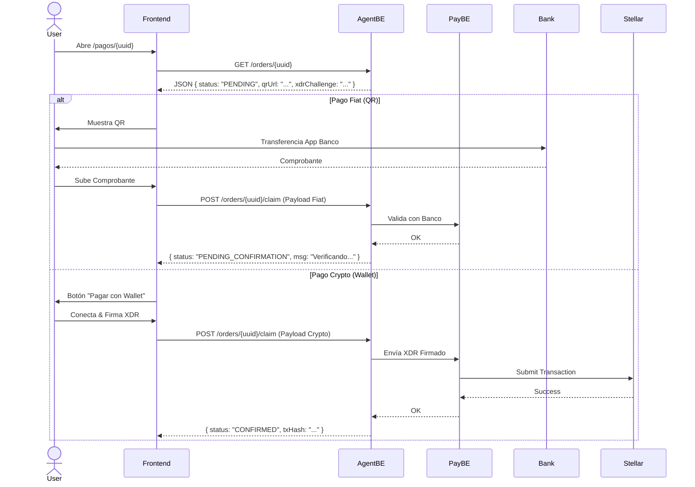

# PasaTanda Project Context: Frontend Developer Guide

## 1. Visión General del Proyecto
**Nombre:** PasaTanda
**Propósito:** Plataforma web y móvil (vía WhatsApp) para automatizar el "Pasanaku" (ROSCA - Ahorro Colaborativo - Tanda - Pasanaku). Permite a grupos de amigos o familiares ahorrar dinero de forma rotativa utilizando tecnología Blockchain (Stellar Soroban) para la transparencia y custodia, pero manteniendo una experiencia de usuario familiar mediante transferencias bancarias locales (QR) y WhatsApp.

**Propuesta de Valor:**
* **Híbrido (Fiat/Crypto):** Los usuarios pueden pagar su cuota mensual mediante transferencia bancaria (QR en moneda local) o directamente con USDC (Stellar Wallet).
* **Transparencia:** Todos los fondos y turnos están registrados en Smart Contracts.
* **Automatización:** Un bot de WhatsApp y Agentes de IA gestionan los recordatorios, verifican pagos y notifican turnos.
* **Rendimiento (Yield):** Opción para que el dinero acumulado genere intereses (vía protocolo DeFi Blend) mientras espera ser entregado al ganador.

## 2. Stack Tecnológico (Frontend Scope)
* **Framework:** Next.js (App Router).
* **Lenguaje:** TypeScript.
* **UI Library:** **Material UI (MUI)** (Estrictamente requerido).
* **Estilizado:** Sistema de diseño minimalista (Blanco/Negro con acentos semánticos), usando tipografía custom `StackSansHeadline`.
* **Integración Web3:** Freighter Wallet (Stellar), manejo de XDR.
* **Integración Backend:** Consumo de APIs REST (`AgentBE` y `PayBE`).

## 3. Arquitectura del Sistema (Contexto Backend)
El sistema se compone de tres piezas principales que el Frontend debe conocer:

1.  **Frontend (Next.js):** Tu responsabilidad. Es la interfaz visual para los pagos y la gestión de la tanda.
2.  **Agent Backend (AgentBE):** El cerebro. Gestiona la lógica de negocio, usuarios, grupos de WhatsApp, y la orquestación de IA (Gemini). Expone los endpoints que consumirás.
3.  **Payment Backend (PayBE):** La pasarela financiera. Maneja la conexión con bancos (Fiat), la Hot Wallet (Crypto) y la Blockchain (Soroban).

---

## 4. Flujos de Usuario Críticos (Frontend)

### A. Onboarding (Creación de Tanda)
El usuario "Organizador" configura la tanda desde la web.
1.  **Formulario:** Ingresa datos (Nombre grupo, Monto Bs/USDC, Frecuencia, Tasa Cambio).
2.  **Verificación Telefónica:** Solicita código SMS/WhatsApp (`GET /api/api/frontend/verify`) y lo ingresa.
3.  **Creación (Draft):** Envía el formulario (`POST /api/frontend/create-group`).
    * *Resultado:* Se crea el grupo en BD y en WhatsApp, pero **NO** en Blockchain aún. El estado es `DRAFT`.
4.  **Activación:** El admin debe escribir "iniciar tanda" en WhatsApp o usar un botón en el UI (si existiera) para desplegar el contrato y activar el juego.

### B. Flujo de Pago (El corazón del Frontend)
Los usuarios reciben un link dinámico en WhatsApp: `/pagos/[orderId]`.

1.  **Landing del Pago (`/pagos/[id]`):**
    * Consulta `GET /api/orders/:id` para obtener detalles (Monto, Estado, QR, XDR).
    * Muestra tarjeta resumen con detalles de la ronda.
2.  **Selección de Método:**
    * **Opción A: QR Simple (Fiat):**
        * Muestra la imagen QR (base64) obtenida del endpoint.
        * Usuario paga en su app bancaria.
        * **Acción:** Usuario sube captura del comprobante.
        * **Request:** `POST /api/orders/:id/claim` con `type: 'fiat'` y metadatos (extraídos o manuales).
    * **Opción B: Stellar Wallet (Crypto - X402):**
        * Usuario conecta wallet (Freighter).
        * Frontend decodifica el `xdrChallenge` recibido.
        * Usuario firma la transacción.
        * **Request:** `POST /api/orders/:id/claim` con `type: 'crypto'` y el XDR firmado.

---

## 5. Referencia de API (AgentBE) para Frontend

Utiliza estos endpoints para construir la interfaz.

### Gestión de Órdenes de Pago
* **`GET /api/orders/:id`**
    * **Uso:** Cargar datos iniciales de la página de pago.
    * **Respuesta Clave:**
        * `status`: Estado actual (`PENDING`, `CLAIMED_BY_USER`, `COMPLETED`).
        * `qrPayloadUrl`: Imagen del QR (Data URL o IPFS).
        * `xdrChallenge`: Transacción Stellar sin firmar (para flujo crypto).
        * `amountFiat`, `amountUsdc`: Montos a mostrar.

* **`POST /api/orders/:id/claim`**
    * **Uso:** Confirmar que el usuario ha pagado.
    * **Payload Fiat:**
        ```json
        {
          "paymentType": "fiat",
          "proofMetadata": { "bank": "...", "amount": 700, "reference": "...", "screenshotUrl": "..." }
        }
        ```
    * **Payload Crypto:**
        ```json
        {
          "paymentType": "crypto",
          "xPayment": "eyJ..." // Token Base64 con el XDR firmado
        }
        ```

### Onboarding
* **`GET /api/api/frontend/verify?phone=...`**: Obtener código de validación.
* **`POST /api/frontend/create-group`**: Crear la estructura inicial de la tanda.

### Proxy de Pagos (Uso Avanzado/Discovery)
* **`GET /api/pay`**: Endpoint polimórfico. Si se llama sin headers, devuelve métodos de pago disponibles (Discovery). Si se llama con `X-PAYMENT`, ejecuta verificación. *Nota: El frontend generalmente usará los endpoints de `/orders` que envuelven esta lógica, pero es bueno conocerlo.*

---

## 6. Diagrama de Secuencia: Ciclo de Pago Unificado

Este diagrama resume cómo interactúa el Frontend con los backends durante el proceso de pago.



## 7. Detalles Técnicos Adicionales
- Autenticación: El frontend de pagos es mayormente público (accedido vía token UUID en la URL), pero acciones críticas pueden requerir validación de sesión o firma de wallet.

- Manejo de Estados: La UI debe ser reactiva a los estados de la orden (PENDING -> CLAIMED -> VERIFIED).

- Seguridad: Nunca expongas llaves privadas ni secrets de API en el código cliente.

- Librerías Recomendadas:

- @stellar/freighter-api: Para conectar wallet.

- @mui/material: Componentes UI.
  
- swr o react-query: Para fetching de datos.