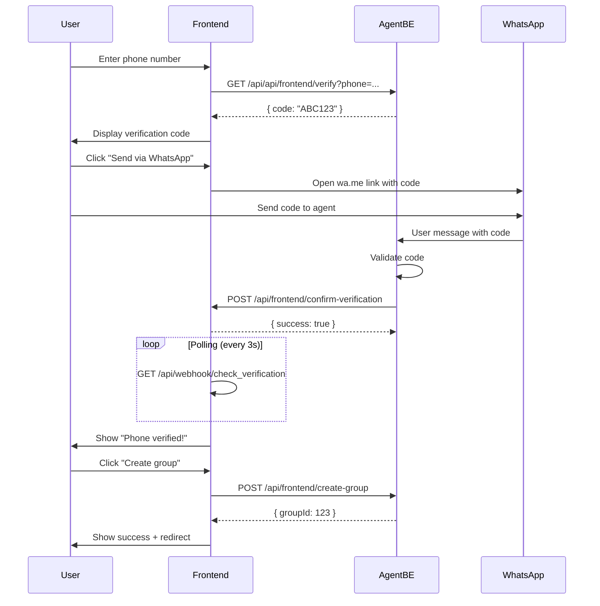

# PasaTanda Frontend - API Endpoints Documentation

This document describes the new API endpoints implemented in the PasaTanda Frontend for the onboarding flow and webhook integration with AgentBE.

## Table of Contents

- [Overview](#overview)
- [Webhook Endpoints](#webhook-endpoints)
  - [POST /api/frontend/confirm-verification](#post-apiwebhookconfirm_verification)
  - [GET /api/frontend/confirm-verification](#get-apiwebhookconfirm_verification)
  - [GET /api/webhook/check_verification](#get-apiwebhookcheck_verification)
- [Environment Variables](#environment-variables)
- [AgentBE Integration](#agentbe-integration)
- [Flow Diagram](#flow-diagram)

---

## Overview

The frontend implements webhook endpoints to receive verification confirmations from the AgentBE service. This enables a seamless phone verification flow where:

1. User requests a verification code from AgentBE
2. User sends the code via WhatsApp to the agent
3. AgentBE validates the code and sends a webhook to the frontend
4. Frontend updates the UI to show verification success

---

## Webhook Endpoints

### POST /api/frontend/confirm-verification

**Purpose:** Receive phone verification confirmations from AgentBE.

**URL:** `POST /api/frontend/confirm-verification`

**Request Headers:**
```
Content-Type: application/json
```

**Request Body:**
```json
{
  "phone": "+591 70000000",
  "verified": true,
  "timestamp": 1703865600000,
  "signature": "optional_hmac_signature"
}
```

| Field | Type | Required | Description |
|-------|------|----------|-------------|
| `phone` | string | Yes | Phone number with country code |
| `verified` | boolean | Yes | Whether verification was successful |
| `timestamp` | number | No | Unix timestamp of verification |
| `signature` | string | No | HMAC signature for security (recommended for production) |

**Response (Success):**
```json
{
  "success": true,
  "message": "Phone verification confirmed successfully"
}
```

**Response (Error - Missing fields):**
```json
{
  "success": false,
  "message": "Missing required fields: phone and verified"
}
```

**Status Codes:**
- `200` - Success
- `400` - Bad Request (missing required fields)
- `401` - Unauthorized (invalid signature, if implemented)
- `500` - Internal Server Error

---

### GET /api/frontend/confirm-verification

**Purpose:** Check if a phone number has been verified (polling endpoint).

**URL:** `GET /api/frontend/confirm-verification?phone={phoneNumber}`

**Query Parameters:**
| Parameter | Type | Required | Description |
|-----------|------|----------|-------------|
| `phone` | string | Yes | Phone number to check (URL encoded) |

**Response:**
```json
{
  "verified": true,
  "timestamp": 1703865600000
}
```

| Field | Type | Description |
|-------|------|-------------|
| `verified` | boolean | Whether the phone is verified |
| `timestamp` | number \| null | Timestamp of verification (null if not verified) |

---

### GET /api/webhook/check_verification

**Purpose:** Convenience endpoint for checking verification status. This is an alias that internally calls `confirm_verification`.

**URL:** `GET /api/webhook/check_verification?phone={phoneNumber}`

**Query Parameters:**
| Parameter | Type | Required | Description |
|-----------|------|----------|-------------|
| `phone` | string | Yes | Phone number to check (URL encoded) |

**Response:**
```json
{
  "verified": false,
  "timestamp": null
}
```

---

## Environment Variables

The following environment variables must be configured for the onboarding flow:

```env
# AgentBE API URL (required)
NEXT_PUBLIC_AGENT_BE_URL=http://localhost:3001

# WhatsApp Agent Number - used for generating WhatsApp links
NEXT_PUBLIC_WHATSAPP_AGENT_NUMBER=123456789

# Optional: Webhook secret for signature verification (recommended for production)
WEBHOOK_SECRET=your_secret_key_here
```

### Variable Descriptions

| Variable | Public | Description |
|----------|--------|-------------|
| `NEXT_PUBLIC_AGENT_BE_URL` | Yes | Base URL of the AgentBE service |
| `NEXT_PUBLIC_WHATSAPP_AGENT_NUMBER` | Yes | WhatsApp number of the verification agent (without + or spaces) |
| `WEBHOOK_SECRET` | No | Secret key for HMAC signature verification |

---

## AgentBE Integration

### Required AgentBE Endpoints

The frontend expects the following endpoints from AgentBE:

#### 1. Request Verification Code
```
GET /api/api/frontend/verify?phone={phoneNumber}
```

**Expected Response:**
```json
{
  "success": true,
  "code": "ABC123",
  "message": "Verification code generated"
}
```

#### 2. Create Group (Onboarding)
```
POST /api/frontend/create-group
```

**Request Body:**
```json
{
  "phoneNumber": "+591 70000000",
  "groupName": "Tanda de los Amigos",
  "amountBs": 10000,
  "amountUsdc": null,
  "frequencyDays": 30,
  "yieldEnabled": false,
  "verificationCode": "ABC123"
}
```

#### 3. Send Verification Webhook (AgentBE → Frontend)

When the user sends the verification code via WhatsApp and AgentBE validates it, AgentBE should call:

```
POST {FRONTEND_URL}/api/frontend/confirm-verification
```

**Request Body:**
```json
{
  "phone": "+591 70000000",
  "verified": true,
  "timestamp": 1703865600000
}
```

---

## Flow Diagram



---

## Security Considerations

### Production Recommendations

1. **Signature Verification:** Implement HMAC signature verification for webhook endpoints:
   ```typescript
   import { createHmac } from 'crypto';
   
   const expectedSignature = createHmac('sha256', process.env.WEBHOOK_SECRET)
     .update(`${phone}:${verified}:${timestamp}`)
     .digest('hex');
   
   if (signature !== expectedSignature) {
     return { success: false, message: 'Invalid signature' };
   }
   ```

2. **Rate Limiting:** Implement rate limiting on webhook endpoints to prevent abuse.

3. **Database Storage:** Replace the in-memory `Map` with a proper database (Redis, PostgreSQL) for verification state persistence.

4. **HTTPS:** Ensure all webhook communications use HTTPS in production.

5. **IP Whitelisting:** Consider whitelisting AgentBE's IP addresses for webhook endpoints.

---

## Error Handling

The frontend handles the following error scenarios:

| Scenario | User Feedback |
|----------|--------------|
| AgentBE unreachable | "Configura NEXT_PUBLIC_AGENT_BE_URL para continuar" |
| Code generation failed | Error message from AgentBE |
| Verification timeout | User can retry sending the code |
| Group creation failed | Specific error message |

---

## Testing

### Manual Testing

1. Start the frontend: `npm run dev`
2. Navigate to `/api/frontend/verify`
3. Complete stages 1-2 (group info)
4. In stage 3, enter phone and generate code
5. Simulate webhook by calling:
   ```bash
   curl -X POST http://localhost:3000/api/frontend/confirm-verification \
     -H "Content-Type: application/json" \
     -d '{"phone": "+591 70000000", "verified": true}'
   ```
6. Frontend should show "Phone verified" in stage 4

### Automated Testing

```typescript
// Example test for webhook endpoint
describe('POST /api/frontend/confirm-verification', () => {
  it('should store verification result', async () => {
    const response = await fetch('/api/frontend/confirm-verification', {
      method: 'POST',
      headers: { 'Content-Type': 'application/json' },
      body: JSON.stringify({
        phone: '+591 70000000',
        verified: true,
      }),
    });
    
    expect(response.status).toBe(200);
    const data = await response.json();
    expect(data.success).toBe(true);
  });
});
```
